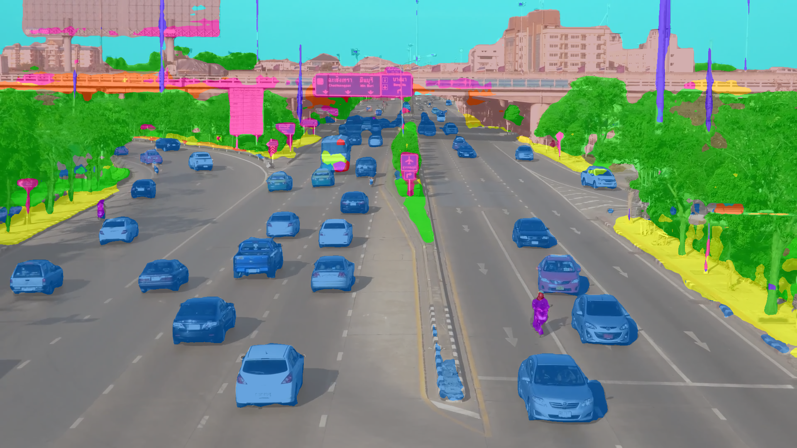
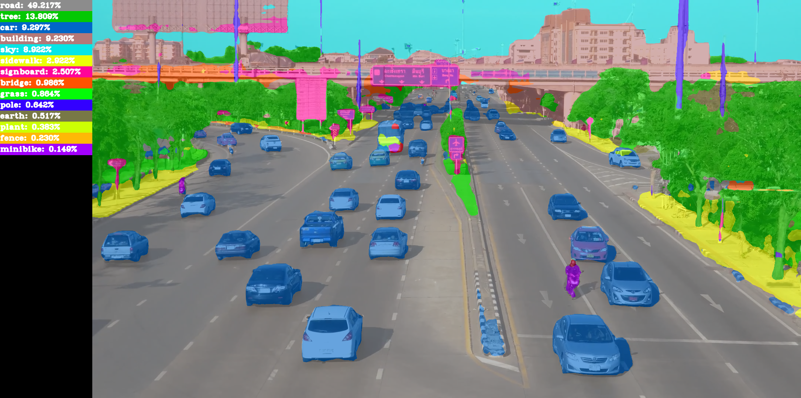
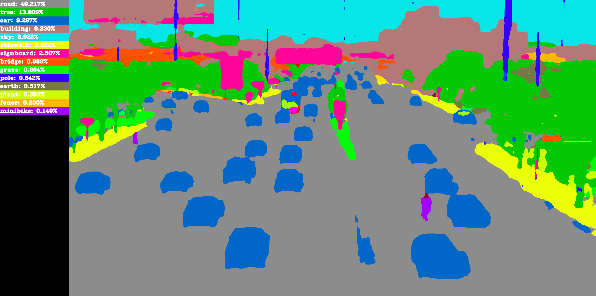
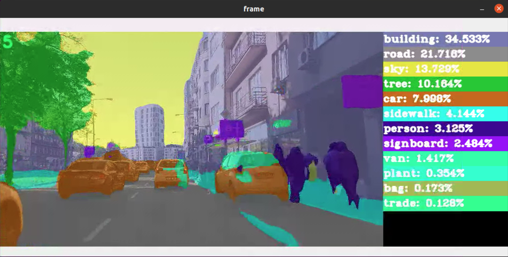
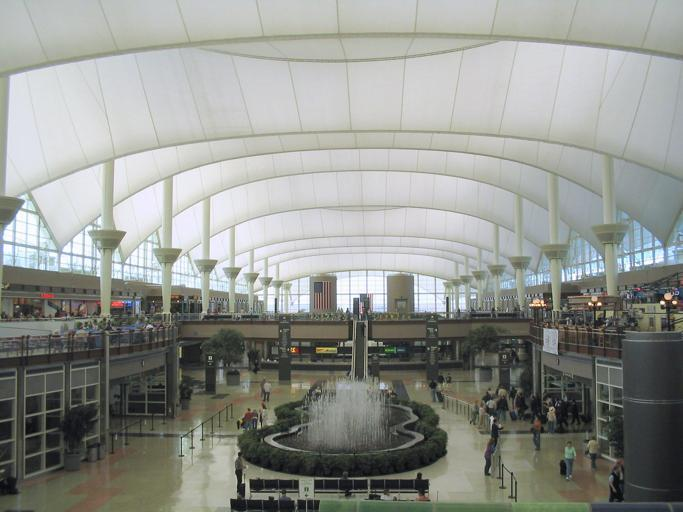
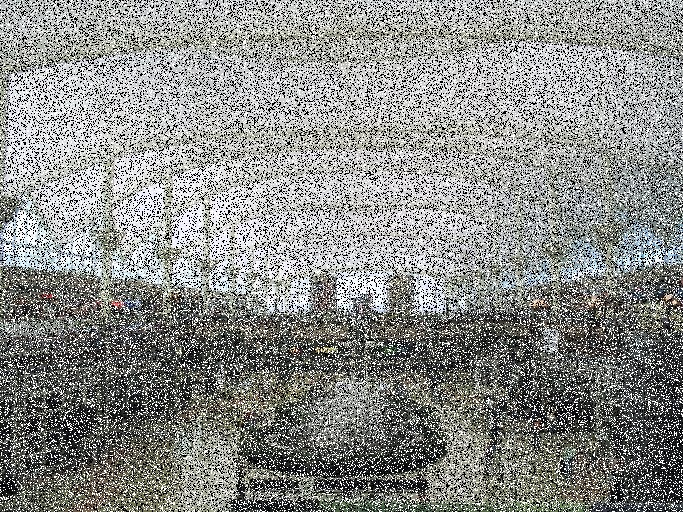

# Realtime Semantic Segmentation

[Original Repository](https://github.com/CSAILVision/semantic-segmentation-pytorch)  

This repository focuses on model inference and visualization.

1. Different ways of displaying the result
    - side-by-side (Provided by the original repo)
    - Transparent prediction mask
    - A color palette showing classes
2. Predict on video
    - mp4 video files
    - realtime inference with webcam
    - saving prediction video


## Scripts
- ```predict_img.py```
- ```predict_video.py```
- ```evaluate_one_img.py```
- ```noise_eval_one.py```


## Requirements
To setup the environment, please refer to the [original README.md](https://github.com/zyang37/semantic-segmentation-pytorch/blob/master/ORG_README.md)
```
git clone https://github.com/zyang37/semantic-segmentation-pytorch.git
cd semantic-segmentation-pytorch
mkdir tmp_results
```
By default, all results will be save under ```tmp_results/```


## Usage
### predict_img.py
```
python3 predict_img.py -h
usage: predict_img.py [-h] -i  [-a] [-s] [-d] [--cfg FILE] [--gpu] ...

PyTorch Semantic Segmentation Predict on image

positional arguments:
                   Modify config options using the command-line

optional arguments:
  -h, --help       show this help message and exit
  -i , --img       an image path
  -a , --alpha     transparent overlay level
  -s , --save      save prediction to
  -d , --display   display real time prediction
  --cfg FILE       path to config file
  --gpu            gpu id for evaluation
```
```
python3 predict_img.py -i car.jpg
```
Results will be saved to ```tmp_results/``` the script uses ```config/ade20k-resnet50dilated-ppm_deepsup.yaml``` by default. You can find the link and download other pre-trained models weights from the [original repo](https://github.com/CSAILVision/semantic-segmentation-pytorch), then ```--cfg config/other_model.yaml```

***Transparent Prediction Mask***  


***Transparent Prediction Mask + Color Palette***  


***Colored Prediction + Color Palette***  



### predict_video.py
```
python3 predict_video.py -h
usage: predict_video.py [-h] [-s] [-d] [-dm] [--save] [--fps] [-a] [-r]
                        [--cfg FILE] [--gpu]
                        ...

PyTorch Semantic Segmentation Predict on image

positional arguments:
                   Modify config options using the command-line

optional arguments:
  -h, --help       show this help message and exit
  -s , --source    video source
  -d , --display   display real time prediction
  -dm , --dmode    display mode
  --save           save prediction video to a directory
  --fps            fps of the saved prediction video
  -a , --alpha     transparent overlay level
  -r , --ratio     ratio for downsampling source
  --cfg FILE       path to config file
  --gpu            gpu id for evaluation
```

Same as ```predict_img.py```, results will be saved to ```tmp_results/``` the script uses ```config/ade20k-resnet50dilated-ppm_deepsup.yaml``` by default. Again, you can find the link and download other pre-trained models weights from the [original repo](https://github.com/CSAILVision/semantic-segmentation-pytorch), then ```--cfg config/other_model.yaml```  
By default, ```--source``` is set to 0 which is the first webcam device.  

```
python3 predict_video.py -s 0
```

```--source``` can also be a mp4 file

```
python3 predict_video.py -s road.mp4
```

Predict on road.mp4 and save the result to out.mp4

```
python3 predict_video.py -s road.mp4 --save out.mp4
```


Inference with high-resolution videos, if you wanted to have higher FPS; you can change ```--ratio```.   

**NOTE**: Downsampling frames will loses some performance but will increases FPS. For older backbones such as ResNet50, it might have a bigger drop in terms of performance.  

```
python3 predict_video.py -s 4k_road.mp4 --ratio 0.2
```

***Realtime Inference on a 4K video (FPS on top left)***  


## Inference Time
Download 7 pre-trained weights
```
bash download_all_weights.sh
```

Run each model on a sample image "teaser/car_detection_sample.png". And all outputs will be pipe into ```inference_time.res```
```
bash test_time_all.sh 
```
It will first run on GPU then CPU. NOTE: if you run into OOM error on GPU, leave the shell script running. (Skipping OOM ones for now)

To Check the results
```
cat inference_time.res  | grep time
```


## Evaluation on Noisy Environment (in progress)
[Repository for noise generation](https://github.com/Rus00/Noisey-image)
- ```evaluate_one_img.py```  
- ```noise_eval_one.py```

Samples  

Original             |  Salt & Pepper Noise
:-------------------------:|:-------------------------:
  |  
